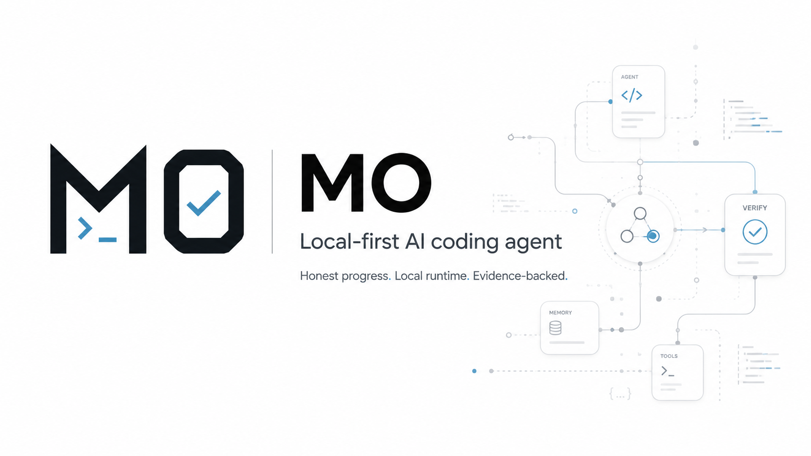

<p align="center">
  
</p>

# MO Agent

**A local-first coding agent for people who want the work to stay honest.**

MO is a Python terminal agent from [IQMO](https://github.com/IQMO). Install it
once, add its generated `mo` command to your `PATH`, then call `mo` from any
project folder. It gives OpenCode/OpenAI-compatible provider models real tools,
then surrounds those models with a local runtime that tracks what actually
happened: task evidence, sandboxed tool dispatch, private memory, code
navigation, long-session continuity, and post-work review.

> **Status: public underdog release.** MO is used daily and already useful, but
> it is still early: terminal-first, fast-moving, and rough in places. This is
> not a polished SaaS product. It is a working local agent runtime being opened
> while it is still being sharpened.

## Why MO Exists

Most coding agents fail in quiet ways. They say work is done because the model
sounds confident. They lose the thread when context gets long. They re-read the
same files every turn. They bury you in generic explanations. They treat your
keys, profile, memories, and project habits as cloud product data.

MO is built against those failures.

The core idea is simple: **let the model drive, but make the runtime keep the
truth.** The provider reasons and uses tools. MO's Gateway, sandbox, task board,
memory, graph, review, and verification layers keep the work local, scoped, and
evidence-backed.

## What Makes It Different

### Runtime-owned progress

MO does not let model prose mark work complete. For real work, the Gateway owns
a compact task board, and tasks close only when runtime evidence exists: files
were inspected, edits landed, tests or checks ran, blockers were observed. Final
answers are not allowed to turn open work into fake success.

### Local-first by default

Your profile, sessions, memory, config, logs, provider keys, and learned terms
live under your private MO home, normally `~/.mo`. A fresh install starts empty.
There is no cloud account requirement, no telemetry requirement, and no server
needed for normal use.

### Provider-first, provider-agnostic

MO is not a wrapper that only works with one model brand. The default config is
OpenCode-first, with DeepSeek v4 Pro for main work, Flash for Ghost, and
OpenAI/Codex-compatible fallback paths when configured. Under the hood, normal
providers use OpenAI-compatible chat completions; Codex can use the local
`~/.codex/auth.json` OAuth path. The model is the engine; MO is the local
runtime that keeps behavior, tools, memory, and reporting consistent.

### Install once, use anywhere

`python mo.py --init` creates a private MO home and command shims:
`~/.mo/bin/mo` for POSIX shells and `~/.mo/bin/mo.cmd` for Windows. Add that
directory to `PATH` once, then run `mo` from any terminal in any project. The
shim preserves the directory you called it from, so MO works on the current
project while keeping its own state under `~/.mo`.

### Long-session continuity

MO keeps more than chat text. It tracks task state, touched files, tool evidence,
provider/tool audits, session state, and code-map orientation so long work can
continue without silently forgetting the important parts.

### Code-aware, not grep-drunk

MO includes local code intelligence: fuzzy symbol search, caller/callee lookup,
and a structural graph under private runtime state. The goal is to spend model
context on the problem, not on repeatedly rediscovering the repository.

### Concise output

MO is answer-first. Tool output is structurally compressed before it reaches the
model context, and final reports focus on the useful delta: what changed, what
was verified, what failed, and what is still unknown.

### Side-checks without stealing truth

Ghost is MO's side-check and planning lane. It can help scope work or sanity
check direction, but it does not own the task board and cannot claim completion.
PRT is MO's post-work review path: it checks diffs with evidence-weighted
findings and can surface issues without turning every change into a ceremony.

### Learning you approve

MO can mine recurring corrections and workflow patterns from your sessions, but
they stay reviewable until you confirm them. Learned guidance is local,
relevance-gated, and subordinate to the current request, sandbox, and runtime
truth.

## Who This Release Is For

Try MO now if you:

- prefer local tools and private project memory over a hosted coding assistant;
- want an agent that reports blockers instead of pretending;
- work in long coding sessions where continuity matters;
- like terminal-first software and can tolerate early-release edges;
- want to inspect and shape the runtime, not just chat with a model.

Wait if you need a polished packaged app, a hosted team dashboard, a plugin
marketplace, or enterprise administration features today.

## Quickstart

Requirements: Python 3.10+ on Windows, Linux, or macOS.

```bash
git clone https://github.com/IQMO/MO.git
cd MO
python -m pip install -r requirements.txt
python mo.py --init
```

`--init` creates/checks your private MO home, normally `~/.mo`, including config,
profile templates, session/log/cache folders, generated `mo` command shims, and
a `.env` file for provider keys.

Add a provider key to `~/.mo/.env` or your shell environment. The default
example config is OpenCode-first:

```env
OPENCODE_API_KEY=your_key_here
```

OpenAI-compatible providers can be added in `~/.mo/config.yaml`. Codex/OpenAI
fallback can use your local `~/.codex/auth.json` when configured.

Run MO:

```bash
python mo.py
```

Then point it at a real project:

```text
find issues in this project
```

For non-trivial work, you should see a compact task checklist appear and advance
only as tools actually run.

Global command: add `~/.mo/bin` to your `PATH`, then run `mo` from any project
directory.

```bash
# Linux/macOS
export PATH="$HOME/.mo/bin:$PATH"

# Windows PowerShell
[Environment]::SetEnvironmentVariable('Path', "$env:USERPROFILE\.mo\bin;$env:Path", 'User')
```

## Capability Map

| Capability | What it means |
| --- | --- |
| Global `mo` command | `--init` creates POSIX/Windows shims so MO can be called from any terminal |
| `/doctor` health check | One-shot offline check of env, config, providers, and core imports; `--json` for scripting |
| Evidence task board | Runtime-owned checklist for real work; model text cannot complete it |
| Sandboxed tools | File, shell, web, and git access pass through local safety gates |
| Private runtime home | Profile, memory, sessions, logs, config, and keys stay under `~/.mo` |
| OpenCode/OpenAI providers | OpenCode-first config, OpenAI-compatible chat completions, and Codex/OpenAI fallback support |
| Provider failover | Providers can fail over on rate, auth, balance, timeout, or empty-response errors |
| Code graph | Local fuzzy search, caller/callee lookup, and structural graph orientation |
| Session continuity | Long work preserves task state, evidence, files, and context orientation |
| `/goal` | Autonomous multi-step work with deterministic completion auditing |
| Ghost | Side-check/planning lane available from the TUI, without owning completion truth |
| PRT (`/prt`) | Post-work review pipeline with evidence-weighted findings; optional auto-regression-tests for fixed bugs (`prt.regression_tests`) |
| Learning loop | Suggestions remain pending until you confirm or dismiss them |
| Profile portability | Export/import local profile and learning state between MO installs |
| Headless service | Optional service mode for non-TUI surfaces such as Telegram polling |
| Hooks | Optional local `~/.mo/hooks.yaml` lifecycle hooks for trusted shell commands |
| MCP tools | Optional: connect operator-configured MCP servers; their tools appear as `mcp__<server>__<tool>`, sandbox-gated (off by default) |

Inside MO, use `/help` for commands or press `F4` for the command palette.

## MCP (Model Context Protocol)

MO can use tools from operator-configured MCP servers — local-first and **off by default**. Add servers to `~/.mo/config.yaml`:

```yaml
mcp:
  enabled: true
  servers:
    - name: filesystem
      command: npx
      args: ["-y", "@modelcontextprotocol/server-filesystem", "/path"]
```

Each server is spawned as a local subprocess (stdio JSON-RPC); its tools appear to MO as
`mcp__<server>__<tool>` and pass the same sandbox gate as native tools. There is no
marketplace and no model-side install — you list the servers. `/doctor` shows MCP status,
and a server that fails to start is reported degraded rather than crashing MO.

## Public Boundaries

This public repo is the product code. It does not include anyone's private MO
home, provider keys, personal profile, project/server knowledge, learned terms,
or session memory. Those belong in each user's `~/.mo` runtime state.

MO's personalization is part of the product idea, but the personal data is not
part of the product defaults. A new user gets the same machinery empty, then MO
adapts through their own approved profile and learning surfaces.

## Privacy And Security

- Keys live in `~/.mo/.env`, shell environment, or configured secret files, not
  in the repo.
- Tool calls pass through sandbox rules for path boundaries, shell safety,
  network policy, and secret redaction.
- A secrets-focused critic checks outgoing answers, and modified files can be
  scanned by turn-end safety checks.
- MO does not need an inbound network listener for normal use.
- Optional Telegram support uses outbound polling; run only one poller for a bot
  token at a time.
- Backend monitor logs are diagnostics only. Runtime task truth stays with the
  Gateway and task board.

## Current Rough Edges

- Terminal-first experience; no packaged desktop app yet.
- Provider setup is manual and expects you to understand your endpoint.
- Internals are moving quickly; docs and command surfaces may change.
- Some advanced paths, such as service mode, tracing, hooks, and PRT fix loops,
  are best treated as builder-facing features for now.

## Design Principles

- **Provider-first:** the model reasons and acts; the runtime enforces truth.
- **Local-first:** user state stays on the user's machine by default.
- **Evidence-first:** reports distinguish verified facts from guesses.
- **No fake progress:** blocked work stays blocked until evidence changes.
- **Small over grand:** prefer simple, inspectable runtime behavior over platform
  theater.

## License

No open-source license has been published yet. Until a `LICENSE` file is added,
this repository is source-available for preview and all rights are reserved by
IQMO.
