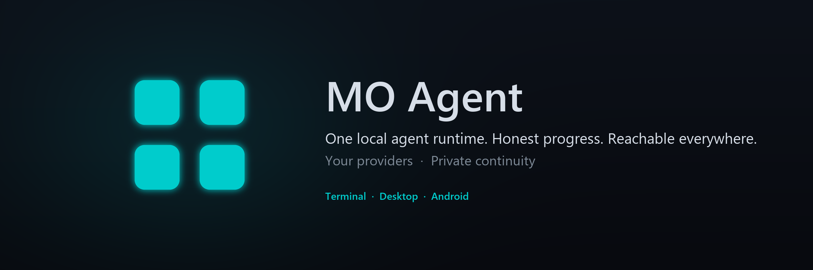

<p align="center">
  
</p>

<h1 align="center">MO Agent</h1>

<p align="center">
  <strong>One local agent runtime. Honest progress. Reachable everywhere.</strong>
</p>

<p align="center">
  <a href="https://github.com/IQMO/MO/actions/workflows/ci.yml"></a>
  
  <a href="LICENSE"></a>
</p>

<p align="center">
  
</p>

MO is a local agent runtime around the AI model you choose. The model proposes;
MO's runtime owns the tools, safety, sessions, memory, proof and continuity, so
your work survives a switch of model, a closed terminal, or a move to another
device. Work in the terminal, MO's main workbench; add MO Desktop as a resident
assistant on Windows; reach your machines from the Android app through your own
Hub; or use Telegram and a headless service. Everything stays private by default.

**[Install MO](#quickstart)** · **[What makes MO different](#what-makes-mo-different)** ·
**[Everything MO does](#everything-mo-does)** · **[Choose an interface](#reachable-everywhere)** ·
**[Read the FAQ](FAQ.md)**

> Start with the [critical FAQ and surface comparison](FAQ.md) if you want to
> understand what runs where, what stays private, or which interface to use.

## What makes MO different

- **A runtime, not a model.** Use any provider, or a local model fully offline; switching providers keeps the same tools, safety, memory and proof.
- **Done means proven.** The runtime, not the model, decides what counts as done: tasks close only on tool evidence, and final-answer gates flag unverified claims.
- **Your work carries on.** Conversations are saved and resumable, interrupted work is kept honestly, several terminals coexist, and each surface knows where the work stands.
- **One runtime, every surface.** Terminal, Desktop, Android, Telegram and a headless service reach the same private runtime; your Hub's provider keys never reach the phone, and the phone runs no second agent.
- **Your phone reaches your machines.** From the phone: chat with your MO, start and follow work, open a terminal on your Hub, drive a running terminal or Desktop, move files. The computers you reach connect out to your Hub, so they open no inbound port.
- **Private, and it learns you openly.** Everything lives in your private MO home; credentials never enter the model's context; learning is reviewable and memory is kept in separate, honest kinds.
- **Deep project work.** A structural code graph, project mapping, project rules, goals with an auditor, background workers, roles and a review team that hands confirmed findings back for fixing.
- **It uses your computer with you.** Target-owned actions on real windows, tabs and controls, each returning its own proof; risky actions ask once; a resident companion you can talk to.

## Everything MO does

Every public feature, grouped by what it gives you: **what it is** — *how you use it.* What you get.
*(setup)* needs an account, an extra install or configuration first; *(closed test)* is in the Android
app's closed testing on Google Play.

### A runtime, not a model

Any provider or a local model; the runtime owns tools, context, discovery and attachments. Provider access and costs are yours; MO does not include an AI subscription.

- **Same MO with any model** — *Automatic.* Your provider proposes; MO's runtime owns the tools, safety, sessions, memory and proof, so switching providers keeps all of it.
- **The right context, automatically** — *Automatic.* Each turn gets the relevant profile facts, earlier conversation, recall, continuity, skills, conventions and code context within a budget; MO records what was actually delivered.
- **Follows your project's rules** — *Automatic in project work.* Reads the project's AGENTS.md rule chain before work; offers a minimal starter when there is none; checks changed rules before reporting.
- **Tools on demand** — *Automatic; ask what MO can do.* MO finds and switches on the right tool from its whole catalog instead of loading everything into every turn.
- **Works offline** — *Configure a local model such as Ollama.* Every capability that runs locally keeps working without the internet; MO never disguises a cloud route as local.
- **Any provider** — */model.* DeepSeek, Z.ai, OpenCode, OpenAI/Codex, Ollama or any OpenAI-compatible endpoint, with fallback.
- **A model per surface** — *Config.* Different models for main, Desktop, voice, prompt enhancement, mapping and review.
- **Spending caps** — *Config.* Limit provider requests per turn.
- **Works in your projects** — *Ask in the Terminal.* Reads, edits, runs commands and tests in your real repo, following its AGENTS.md rules.
- **Web research** — *Ask it to look something up.* Searches the web (ranked results with your search key) and reads pages as untrusted evidence.
- **Read any GitHub repo** — *Name a repo or paste its URL.* Answers questions from a repo's code and docs without installing anything, or turns it into a reviewed skill.
- **Attachments anywhere** — *Attach files to a turn.* Up to eight files per turn from any surface, kept private and treated as untrusted.
- **extrathink** — *Add the word extrathink.* MO re-audits its work before finishing.
- **Reads PDFs** *(setup)* — *Give it a PDF.* Text from PDFs into the conversation.
- **MCP tools** *(setup)* — *Add servers to config.* Bring external tool servers in, behind the same sandbox.

### Done means proven

Task truth, verification, final gates, goals and reviews run on evidence.

- **Done means proven** — *Automatic.* A task only closes with tool evidence; unverified results are said plainly.
- **Live taskboard** — *Automatic for real work.* Rows with dependencies and approval gates; resume where you left off.
- **Goals** — */goal <task>.* Autonomous multi-step work audited against your own rules; Ctrl+G sends it to the background; /goal pause lets the current step finish, then pauses.
- **Project Review Team** — */prt.* A review of your changes with evidence and a score; confirmed issues handed back for fixing.
- **PRT on GitHub** *(setup)* — *Enable GitHub delivery.* Posts PR reviews and a status check, answers PR questions, plans issues.
- **Docs stay in step** — *Automatic.* Flags code changes whose documentation wasn't updated.
- **LSP diagnostics** *(setup)* — *Configure language servers.* Real compiler/linter diagnostics after every edit.

### Continuity: your work carries on

Saved, resumable, honest sessions; portable conversations; continuity across surfaces and terminals.

- **Every conversation saved** — */session, /new, /projects.* Conversations are saved privately and grouped by project; reopen, rename or switch any of them.
- **Resume, retry, undo** — */resume, /retry, /undo.* Pick up an earlier conversation, retry the last request, or undo the last turn.
- **Interrupted work is kept** — *Automatic.* If a turn is cut off (stop, crash or power loss), your request and the tool work already done stay in history, marked interrupted; nothing resumes on its own.
- **Continuity** — *"What were we busy with?".* Answers from real runtime state, then memory; resumable banners.
- **Handoff instead of forgetting** — *Automatic on long sessions.* Long contexts continue without destructive compaction.
- **Several terminals at once** — *Open another terminal; /heartbeat instances.* Each terminal keeps its own conversation; MO sees what its sibling terminals and MO Desktop are doing, checks before touching shared work, and running MOs can message each other (delivered once, never as an instruction).
- **Portable sessions** — */session share.* Named conversations that move between surfaces.
- **Continuity across surfaces** *(setup)* — *Automatic once your Hub is set up.* Each surface shares a short note of intent, outcome and next step through your Hub, so the phone, Desktop or another terminal knows where things stand; never raw transcripts, tool output or secrets.
- **Continue on…** *(closed test)* — *History → Continue on.* Move a conversation to the terminal, Desktop, another phone or Telegram.
- **Desktop follows your terminal** — *Ask the companion what the terminal is doing.* The companion reads what the bound MO terminal is working on and takes it as context, then says so on the cubes; it changes nothing.
- **Honest session closeout** — *Automatic at the end of a session.* MO records what is clean, what is unresolved, open goals and workers, and uncommitted work, so the next start begins from the truth.

### Your Hub, your phone, your machines

Your own Hub, the Android app, remote terminals, Live Control, files and transfers, Telegram and a headless service. Android is in closed testing on Google Play; see the [Android guide](ANDROID.md#availability).

- **Your own Hub** *(setup)* — */everywhere setup on your computer or server.* An authenticated hub you run yourself; devices pair to it with exact, revocable scopes; the computers you reach from the phone connect out to it, so they open no inbound port.
- **Chat with your MO** *(closed test)* — *Hub chat.* Your full MO from the phone, with history and named conversations.
- **Control → Work** *(closed test)* — *Phone Control tab.* Start and follow background work and schedules; notifications when done.
- **Start a terminal from the phone** *(closed test)* — *Control → Start MO terminal.* A fresh MO terminal on your Desktop or Hub, ready to watch.
- **Live Control** *(closed test)* — *Phone → Remote.* Drive your Desktop and MO terminals by touch, virtual cursor and keyboard.
- **Terminal workspaces on the phone** *(closed test)* — *Phone → Remote.* Your running MO terminals grouped into one workspace you can drive from the phone; closing a view never kills a terminal.
- **Live Control host** *(closed test)* — *Pair a phone with Live Control.* Share this screen with your paired phone, which can drive it.
- **The phone cube** *(closed test)* — *Install MO Everywhere.* A floating cube on your phone; tap cycles Dashboard, Chat, Control, Files.
- **Pair a phone by QR** *(closed test)* — *MO Phone → pair.* A one-use QR code to pair your Android with your Hub.
- **Setup in plain words** — *Ask MO about Everywhere or the Android app.* Where the Hub runs, where to get the app, which credentials are present, what blocks setup, and the one next step.
- **Files and transfers on the phone** *(closed test)* — *Files tab.* Panes across Hub, Desktop, terminals and phone; verified transfers.
- **Send files between your machines** *(setup)* — */send, /transfers, or ask.* Resumable, verified transfers between your paired computers and phone, with receipts on both sides.
- **MO Files** — *Launcher → Files.* One file manager across this PC, your other MO machines and your phone; previews and verified transfers.
- **Quick Share** — *MO Files → share.* A short-lived link on your local network so any device with a browser can grab a file.
- **Kill switch and consent** *(setup)* — *mo_everywhere CLI.* Pairing, capabilities, consent and a kill switch from the terminal.
- **Share a phone folder** *(closed test)* — *Pick a folder.* Let your other MO devices read one folder you choose.
- **This-phone chat** *(closed test)* — *Chat → This phone.* Direct chat with your own provider key when no Hub is around.
- **Phone voice and charging cue** *(closed test)* — *Mic button; plug in.* Dictation into the draft; the cube plays its charging emote.
- **Phone trackpad and pen** *(closed test)* — *Launcher → hover MO Phone → Trackpad.* Your phone becomes the PC's mouse and keyboard; Board mode draws as a real Windows pen.
- **Telegram remote** *(setup)* — *Pair your Telegram.* Talk to MO from Telegram; approve actions; /status /stop /continue /cancel.
- **Headless and Docker** — *mo_service.py / compose.* Run MO as a service on a server.

### Private, and it learns you

Profile, terms, memory, reviewable learning, skills and moving in from other agents.

- **It remembers you** — *Automatic.* Profile facts, preferences and your project list, private on your machine.
- **Your words** — *Define a shorthand.* MO learns your terms and abbreviations.
- **It learns from corrections** — *Correct it.* Rules learned from your feedback, shown as ◈ learned notices.
- **Learning you can review** — */learning.* See what it learned; confirm or dismiss suggestions.
- **Recall past conversations** — *Ask about earlier work.* Keyword recall, optional meaning-based recall.
- **Skills** — */skills.* Local skill packs chosen by task and by the code you're touching.
- **Learn from a repo or docs** — *"Learn from <GitHub repo / docs site / llms.txt>".* Risk-scanned, use once or promote to a skill.
- **Move in from other agents** — *"Move me from OpenClaw/Hermes".* Inspect, plan and import identity, memory and rules; secrets skipped.
- **Onboarding** — *First run.* Notices it doesn't know you yet and learns your name and setup.
- **Profile sync between your computers** *(setup)* — *Configure a private Git remote.* Your curated profile on every machine, over your own SSH.
- **Move learning between machines** — *Learning bundle export/import.* Your learned state travels to your other MO.

### Safe by design

One sandbox for every tool call, exact confirmations, secrets kept out, untrusted content fenced.

- **One safety gate** — *Automatic.* Every tool call passes one sandbox: paths, destructive commands, network, secrets.
- **Secrets stay secret** — *Automatic.* Credentials never enter the model's context; answers are scanned and redacted.
- **Your forbidden phrases** — *Edit answer_rules.md.* Phrases MO must never say, or must warn about.
- **Injection and malware guard** — *Automatic.* Blocks instruction smuggling in memory and refuses to build malware (authorized security work allowed).
- **Changed-file security check** — *Automatic.* Scans changed files for hardcoded secrets and unsafe shell.
- **Untrusted content fenced** — *Automatic.* Web pages and imports are marked untrusted before MO reads them.
- **Risky actions ask once** — *Automatic.* Ordinary actions need no approval; deleting or discarding work asks once; a corner flick stops the mouse.
- **Panic Stop and Action Log** — *Tray.* Stop everything MO is doing at once; see every action it took.

### The engineering workbench

The Terminal: workspace and panes, code graph and maps, roles and workers, presentation and orientation.

- **Split-terminal workspace** — */workspace.* Split MO into panes with ordinary terminals.
- **Remote panes** *(setup)* — */workspace new on another MO machine.* Panes of MO terminals running on your other machines, in one grid.
- **Run any agent inside MO** — */terminal codex, /terminal claude.* Codex, Claude or any shell on MO's own console, then back to MO.
- **Workspace rail** — *Ctrl+B.* Your projects and their local and host terminals in one rail; switch live groups without stopping them; a quiet Health view of machine resources.
- **Code graph and search** — *Ask "where is…", or /structural-graph.* Finds the owning file and symbol by meaning; who calls what.
- **3D code map** — */dashboard map.* An interactive 3D map of your codebase, coloured by your skin, overlaid with current work.
- **mapthis** — *Add the word mapthis.* Maps a whole project into a docs page with verified citations, using parallel workers.
- **Project history and knowledge** — */knowledge, or ask how something changed.* Git history joined to code; source-linked project knowledge.
- **Redundancy scan** — *Ask for duplicates.* Finds duplicate and near-duplicate code.
- **Graph for other agents** *(setup)* — *Add the mo-graph MCP server to Claude Code or others.* Other coding agents use MO's code graph.
- **Mologrthim** — *Launcher → Mologrthim.* MO's operations floor: every running MO, their specialists' checked work and rank, candidates waiting for your hire, MO Care; assign work, hire or pause a goal through that MO.
- **Inventory** — *Launcher → Inventory.* A basket of everything MO did with you, today first; search, pick several and drop them on a running MO terminal, where they wait in its composer.
- **Background workers** — *Ask for parallel work; /activity.* Workers in their own sessions, with completion notices and conflict detection.
- **Roles** — */role <name>.* Reusable perspectives that govern a conversation, workers or schedules.
- **Project Architect** — */role project-architect.* Calibrates a project and dispatches specialists it registers from evidence.
- **Book Writer** — */role activate book-writer.* MO writes a book on any subject you pick (PDF, EPUB or print), keeps your library of books, and reads them aloud on request; it never invents facts about real people or events.
- **Game Collaboration** — */game start.* A game project's questions, decisions, proposals and approvals, kept in one place.
- **Skins and window effects** — *Settings.* Pick or make a skin, and a window effect for every MO window.
- **Prompt enhancer** — *Ctrl+E while typing.* Rewrites your own request more clearly before you send it.
- **Steer while it works** — *Type during a turn.* Your message queues or steers the running work.
- **Command palette** — *Press /.* Every command, grouped, with submenus.
- **Live footer** — *Automatic.* Context use, provider quota or balance, and updates waiting.
- **Custom skins** — */skin.* Built-in skins or your own; one skin themes Terminal, Desktop, phone and code map.
- **Inline images and charts** — *Ask for a chart or image.* Truecolor images, bar charts, sparklines and tables right in the terminal.
- **Arabic input** — *Type Arabic.* Right-to-left text shown correctly in the TUI.
- **Rotating hints** — */hints.* Tips on the idle line; your own hints.txt.
- **Full Dashboard** — *Launcher → Dashboard, or /dashboard html.* Your own view: who you are, projects, what MO learns, work pulse; a brain map of memory and learning.

### It uses your computer with you

Computer use, the Desktop companion and its apps, voice, MO Shell and PC care.

- **Uses your PC** — *Ask in plain words.* Opens apps and sites, clicks, types, closes windows; each action returns its own proof.
- **Points the way** — *"Where is…?" / "show me".* The cubes glide to the spot and label it.
- **Walkthroughs** — *"Walk me through…".* Numbered on-screen steps over the real controls.
- **Sees the screen** — *Ask about what's on screen.* Captures the right window by handle, even behind others, and explains it.
- **Works in your Chrome** *(setup)* — *Install MO Connected Tab.* Acts inside your real Chrome tab; no separate browser.
- **Four-cube companion** — *Runs on the desktop; Win+Alt+M summons it.* A small companion that lives on your screen and comes when called.
- **Desktop recipes** — *Recorded step sequences.* Transparent replay of known desktop steps.
- **Living panel** — *Left-click the cubes* (again to close). One panel grows from the cubes: type, attach, choose; replies appear in place.
- **The swallow** — *Drag a file near the cubes and drop it.* Their mouth opens by distance and they swallow the file; it's attached to your message.
- **Files in your sentence** — *Drop or attach a file while you write.* It sits where you are typing as a named chip ([Image1], [Video1], [File1]); point at it for a small preview, Backspace removes it, and MO is told which file each name means.
- **App launcher** — *Double-click the cubes.* Four grouped app tiles (Work, Devices, Care, Your apps); add your own files and folders; drag to arrange.
- **Compact Dashboard** — *Right-click the cubes.* Home, Work, You and Systems at a glance, with project checks.
- **Screen capture by hold** — *Hold a cube for two seconds, drag a rectangle.* A full-resolution snip you can preview and send to MO.
- **Volume and brightness on the cubes** — *Scroll over the cubes* for Windows volume; *Shift + scroll* for the brightness of the screen they sit on (a laptop panel's own brightness, or MO's dim layer on an external screen).
- **Clipboard history** — *Win+Shift+Z, or hold the top-left cube.* What you copied, in the one panel: copy it again, ask MO about it, or remove it. Memory only; secrets are masked and never sent.
- **Chase or rest** — *Ctrl-Ctrl.* The cubes follow your cursor, or stay where you left them.
- **Body language** — *Automatic.* The cubes react to real events with their own emotes.
- **Personality** — *Settings: moodiness, warmth, playfulness.* Tune how lively the companion is.
- **Characters for roles and tools** — *Activate a role or connect a tool server.* The cubes change colour and formation to show who is working.
- **Glance notices** *(setup)* — *Automatic.* Mail, finished work and reminders arrive as one short line; details when you look.
- **Docks to its terminal** — *Automatic.* The cubes know their own MO terminal window and sit by it.
- **Stays above dimmers** — *Automatic.* Keeps the cubes visible over approved always-on-top overlays such as a screen dimmer.
- **Pick-and-submit choices** — *When MO offers options.* Choices appear as buttons instead of text you retype.
- **Report an issue** — *Ask, or the report action.* Opens a separate report session so the companion stays clean.
- **Hands real code to the Terminal** — *Ask the companion for a code change.* It hands the request to the same project's live MO Terminal, or opens one in MO Shell with your request as its first turn; say "on the server" and it runs on your paired MO host.
- **Focus mode** — *Hold the lower-right cube, or the tray.* A window switcher with previews, app and file search, taskbar pins, tray icons, calendar, dimming and power controls.
- **MO Phone (mirror)** *(setup)* — *Launcher → Phone.* Your Android screen live on the PC (scrcpy), USB or wireless; MO can keep a frame to see your phone.
- **Settings app** — *Launcher → Settings.* Cube size, glow, corners, formation, colour; window effects; movement; voice; role.
- **Hold to talk** — *Double-Alt, hold, speak, release.* Speak anywhere; local recognition (Whisper or Windows) in English and Arabic.
- **Instant spoken replies** — *Talk to it.* A fast voice layer answers at once, sentence by sentence, instead of waiting for a full turn.
- **It says what it's doing** — *During a task.* Short spoken progress ("Opening it now.") instead of silence.
- **Talk while it works** — *Speak during a task.* Questions are answered right away; new work queues behind the task.
- **Voice commands** — *Say stop, repeat, or what are you doing (English or Arabic).* Instant control without a model call.
- **Continuous Voice Chat** — *Tray toggle.* Hands-free listen, answer, listen.
- **Hands to a task** — *"Open my report and…".* Anything needing tools is handed to MO in your own words and spoken back when done.
- **Your own voice** *(setup)* — *Point Settings at a voice clone you trained.* MO speaks in your voice; it never ships anyone's cloned voice.
- **Arabic speech** *(setup)* — *Configure an Arabic voice.* Arabic replies spoken; never misread by the English voice.
- **MO Shell** — *Launcher → Shell.* A floating native window for your MO terminal, attached to one window you choose; in a fresh conversation MO names the attached app and asks how it can help.
- **SystemCare app** — *Launcher → SystemCare.* The PC-care workspace.
- **Scan, plan, apply, undo** — *SystemCare scan.* A read-only scan, an exact plan you approve, and receipts you can roll back.
- **Game Mode** — *Game Session in the tray.* The PC set up for gaming, then restored.
- **Care actions** — *From a plan.* Startup items and services, Windows repair, disk optimisation, DNS, updates, app leftovers, browser history, Recycle Bin, drivers and PATH duplicates.
- **Scheduled care** — *Schedule a scan.* Care jobs that run on schedule without a model turn.
- **MO Care** — *Automatic, every 15 minutes.* MO watches its own background without a model (provider and turn errors, workers that ended blocked, apps that failed to open, failed scheduled jobs, failing offline checks) and reports each problem once in MO Desktop or the terminal; Investigate opens a terminal.
- **Care for your projects and servers** — *Choose a project or host.* Inspection of selected projects and configured servers.

### Life and making things

Mail, Life records and money, schedules, MO Design, visuals, images and explainer videos. See [mail setup](core/mail/README.md) and [Life records](core/life/README.md) for the privacy and account limits.

- **Mail** *(setup)* — *"Check my mail" / Gmail or Outlook.* Search, read, draft; send and delete only after you confirm.
- **Life records** — *"Track my car insurance".* Commitments and cases with dated updates and payment plans.
- **Money** — *"I paid 40 for…".* Income and outgoings with a month view and summary.
- **Schedules and reminders** — */schedule add <when> :: <task>.* Plain reminders, timed MO turns and scripts, delivered to Desktop or Telegram.
- **MO Design Studio and Board** — *Launcher → Design.* Sketch on a shared Board with MO; MO proposes, you accept; live previews; send the result to a terminal or a background Goal.
- **Images** *(setup)* — *"Make an image of…" / "crop this".* Generate, edit and show images.
- **Generate** *(setup)* — *Composer → Generate; pick image, video or song.* Seedream images, Seedance video and Suno music through your Kie.ai key: references named in your sentence ("the motion of [Video1] on [Image1]"), checked against what the model takes as you drop them, Refine to sharpen the prompt, your credits shown, and saved results that play from the composer.
- **Diagrams** — */visualize.* JSON, YAML, Markdown or folders as Mermaid or ASCII diagrams.
- **Explainer videos** — *"Make an explainer about…".* Narrated videos with captions, rendered locally.

### Setup and operations

Install, health checks, credentials, updates and settings.

- **Health checks** — */doctor, /status, /usage, /now.* Offline health, status, token use and the current snapshot.
- **Self-update** — */update.* Fast-forward update that reinstalls dependencies only when needed.
- **One-step setup** — *mo.py --init; /credentials, /settings, /reload.* Creates your private home, config, credential templates and launchers; checks credentials without showing them.

## Reachable everywhere

| Surface | Best for | What you need |
| --- | --- | --- |
| **MO Terminal** | Coding, research, file work, goals, reviews and automation | The base install and your provider; add screen tools only when needed |
| **MO Desktop** | Dashboard, visual design, screen help, voice and files | Optional companion and computer-use packages; native Desktop is Windows-focused |
| **MO Shell** | Keep the terminal beside a selected app in a floating workspace | Optional native Windows shell around the existing terminal |
| **MO Everywhere for Android** | Conversations, tasks, schedules, Remote and Files while away | Google Play access and your running Hub for connected features; separate **This phone** chat needs only your provider |
| **Telegram** | Remote conversation and approvals | Your configured bot and running MO service |
| **Headless service** | Keep the Hub, scheduler and integrations running | Your computer/server, selected extras and private configuration |

Detailed ownership, capability, and limitation rows are in
[FAQ — Which MO surface should I use?](FAQ.md#which-mo-surface-should-i-use).
The machine-checked [product and capability contract](CAPABILITIES.md) maps
every built-in command and major capability to its runtime, surface, state,
security, discovery, and acceptance owners.

## MO Everywhere in one minute

**[Watch the 60-second walkthrough](https://youtu.be/OgEWYONoGlo)** ·
**[Closed-test access on Google Play](https://play.google.com/apps/testing/app.moagent.mobile)** ·
**[Features and setup](ANDROID.md)**

The film uses native Android UI with fictional sample content and supporting
illustration. Your own running computer/server supplies connected agent work;
the phone does not run the full MO tool runtime. Android is currently in
**closed testing for eligible users**, with Google Play as its only public
installation and update source. The [Android guide](ANDROID.md#availability)
owns current availability. The repository contains no Android package downloads.

## Quickstart

You need Git, Python 3.10+, and access to one supported AI provider or a local
model server. MO runs from this checkout; you do not need to develop MO or install
its maintainer test tools to use it. The base install has five direct dependencies.

### 1. Install and initialize

On **Windows PowerShell**, use the virtual environment's Python directly:

```powershell
git clone https://github.com/IQMO/MO.git
cd MO
python -m venv .venv
.\.venv\Scripts\python.exe -m pip install --upgrade pip setuptools
.\.venv\Scripts\python.exe -m pip install -r requirements.txt
.\.venv\Scripts\python.exe mo.py --init
```

On **Linux or macOS**:

```bash
git clone https://github.com/IQMO/MO.git
cd MO
python3 -m venv .venv
.venv/bin/python -m pip install --upgrade pip setuptools
.venv/bin/python -m pip install -r requirements.txt
.venv/bin/python mo.py --init
```

Keep this checkout and virtual environment: the generated command uses them.
If your Linux Python installation lacks `venv` or pip, install those components
through your operating system's package manager first.

Initialization creates your private `~/.mo` home, config and credential templates,
and the `mo`/`mo.cmd` launchers under `~/.mo/bin`. On Windows, `~` means your user
profile directory. Repeating `--init` preserves existing config and credentials.
It does not initialize or modify the project you are working in.

### 2. Configure a provider

Choose one provider from [`config.example.yaml`](config.example.yaml). For the
default DeepSeek route, fill in `DEEPSEEK_API_KEY` in the generated private
`~/.mo/credentials/providers.env`. You do not need keys for every provider listed
in the template. Provider availability, model access, and billing belong to your
provider account.

In `~/.mo/config.yaml`, keep the selected provider's configuration and set
`model.default` to its name. For example, these are the relevant DeepSeek sections:

```yaml
providers:
  - name: deepseek
    type: chat_completions
    base_url: https://api.deepseek.com
    api_key_env: DEEPSEEK_API_KEY
    model: deepseek-v4-pro

model:
  default: deepseek
```

MO reads provider keys from that canonical credential file. `api_key_env` is a
logical key name, not a request to read arbitrary process environment variables.
Keep keys and personal configuration out of the checkout.

Local Ollama models use the same `chat_completions` interface at
`http://localhost:11434/v1`; no MO-specific local-model dependency is required.
For the other supported routes, see [Which providers work?](FAQ.md#which-providers-work).

### 3. Run MO in your project

Add `~/.mo/bin` to your user `PATH` once and open a new terminal. Go to the project
you want MO to work on, then run:

```text
mo
```

The launcher uses MO's virtual environment while preserving your current project
directory. Without changing `PATH`, invoke `& "$HOME\.mo\bin\mo.cmd"` in PowerShell
or `~/.mo/bin/mo` on Linux/macOS from the same project directory.

Try a small first task: **“Read this project's README and explain how to run it.
Do not change files.”** Use `/credentials` to check provider readiness without
displaying keys, `/model` to select a provider/model, and `/doctor` for runtime
health. For scripts, the same launcher supports:

```text
mo -p "review the current diff and report verified findings"
mo --prompt-file task.txt
```

`/model`, `/show`, `/hints`, and `/activity` save Terminal preferences privately;
authored config remains the baseline. `/doctor personalization` provides a
read-only profile, learning, memory, and retention audit. `/profile provider`
records profile metadata only.

### Install only the extras you use

Run optional pip commands with the same virtual environment's Python used above
(or activate that environment first). Terminal text, file, shell, and provider
work do not need the Desktop, voice, Hub, or local embedding packages.

| Optional use | Install in MO's virtual environment |
| --- | --- |
| Desktop companion and native screen/input tools | `python -m pip install -r requirements-computer-use.txt` on a machine with a display; native Desktop is Windows-focused |
| Serving Everywhere Hub | `python -m pip install -r requirements-everywhere.txt` on the serving computer/server |
| MO Design windows | `python -m pip install -r requirements-design.txt` |
| Read embedded PDF text | `python -m pip install -r requirements-perception.txt` |
| Local semantic memory embeddings | `python -m pip install -r requirements-embeddings.txt`; keyword recall and API embeddings do not need it |
| Local Desktop voice | Use the [isolated voice installer](mo_desktop/README.md#voice); it manages `requirements-voice.txt` separately |

`requirements-dev.txt` is for maintaining MO, not normal use. Optional features
can also require platform tools or permissions described in their own guides.

### Limit provider requests

To enforce a request limit, set it explicitly in your private config:

```yaml
agent:
  max_provider_requests_per_turn: 8
```

Run `/reload`, then `/settings` to check the configured value. The default is
`0` (unlimited). For a one-shot run, use
`mo --config path/to/config.yaml --prompt-file task.txt` with your configured
provider and this limit. A limit written only in the prompt is not enforced.

The cap counts model completion attempts, including retries and auxiliary or
worker calls started from that turn. Internal continuation shares the same
allowance. Exhaustion stops further provider requests and leaves unfinished
work open. HTTP redirect hops, credential refresh and separate embedding work
are outside this count. It is not a token, cost, or elapsed-time limit.

Python callers can override the config for one turn with
`gateway.run_turn("Review the current diff", max_provider_requests=8)`.
The argument defaults to `None` (use config); `0` disables the cap for that new
turn.

### Optional surfaces

- **MO Desktop is an opt-in auto-intent companion.** Install the computer-use
  extras above, set
  `mo_desktop.enabled: true`, then run
  `python -m mo_desktop` or use `/desktop`. See
  [`mo_desktop/README.md`](mo_desktop/README.md).
- **MO Design desktop previews:** install
  `python -m pip install -r requirements-design.txt`. Open **MO Design** from
  the Desktop tray or let MO create a design during a turn. A `.modesign` file can
  also be opened directly with `python -m mo_desktop.mo_renderer path.modesign`.
  Explicit sketch and diagram requests can open the same artifact as a compact
  Board-only window connected to the exact originating terminal. A drawing
  follow-up reads the current Board; Accept/Reject returns only the draft
  decision and does not grant implementation authority.
  See the [artifact format](core/design/README.md) and
  [Studio runtime](mo_desktop/design_studio/README.md) guides.
- **Everywhere hub and native clients:** install
  `requirements-everywhere.txt` on the one serving owner, run the normal
  `mo_service.py`, and follow `/everywhere setup`. See
  [`mo_everywhere/README.md`](mo_everywhere/README.md).
- **Headless container:** `Dockerfile` and `compose.yaml` run the same
  `mo_service.py` owner as a non-root user with read-only image source, one
  explicit private-state mount, and one mounted project workspace.
- **Android resident Dashboard/Chat/Control/Files:** install only from Google
  Play when eligible, then pair it with the serving hub. The Android guide below
  owns the current release status and closed-test versus Production availability.
  See [`ANDROID.md`](ANDROID.md).

### Headless Docker service

Set two path-only variables in an untracked `.env` beside `compose.yaml` (do
not put credentials there — provider keys belong in
`~/.mo/credentials/providers.env`; the tracked [`.env.example`](.env.example)
is the name-only template for that credentials file, not for this one):

```env
MO_STATE_DIR=/absolute/private/path/mo-state
MO_WORKSPACE=/absolute/path/to/the/project
```

The state directory must be outside the MO checkout and writable by the image
user (UID/GID 10001 by default; override `MO_UID`/`MO_GID` when building on
Linux). Initialize that mounted private home once, then start the resident:

```text
docker compose build
docker compose run --rm --entrypoint python mo /app/mo.py --init
docker compose up -d
```

Edit `config.yaml` and the canonical credential files directly inside
`MO_STATE_DIR`; secrets are never build arguments or image layers. The default
compose service publishes no ports. Use the documented native host/TLS
deployment for an Everywhere hub instead of exposing its loopback API from
this default container.

## Documentation

| Document | Authority |
| --- | --- |
| [`CAPABILITIES.md`](CAPABILITIES.md) | Product charter, capability owners, complete command coverage, and the full behavior reference |
| [`FAQ.md`](FAQ.md) | Critical user questions and full surface comparison |
| [`MAP.md`](MAP.md) | How the runtime fits together: compact source and ownership map |
| [`AGENTS.md`](AGENTS.md) | Repository work contract for maintainers |
| [`core/MAINTAINING.md`](core/MAINTAINING.md) | Runtime, state, graph, and public/private invariants |
| [`interface/README.md`](interface/README.md) | Terminal interface contract |
| [`mo_desktop/README.md`](mo_desktop/README.md) | Desktop behavior and configuration |
| [`mo_desktop/MAINTAINING.md`](mo_desktop/MAINTAINING.md) | Desktop maintenance boundaries |
| [`mo_everywhere/README.md`](mo_everywhere/README.md) | Hub, continuity, pairing, API, and Live Control |
| [`clients/chrome/README.md`](clients/chrome/README.md) | Connected Chrome setup, consent, status, removal, and source ownership |
| [`ANDROID.md`](ANDROID.md) | Android availability, requirements, setup, and user privacy boundary |
| [`mo_publisher/README.md`](mo_publisher/README.md) | Optional public publisher pages, isolated AI-report custody, and operating requirements |
| [`CHANGELOG.md`](CHANGELOG.md) | Repository change history |

Validate public documentation links with:

```bash
python -m core.diagnostics.docs_check
```

## Privacy and security

- The repository contains product code, not operator profile data.
- Credentials stay in scoped files under `~/.mo/credentials/` and never enter
  model-visible config.
- Tool calls pass through path, network, command, actuation, and secret guards.
- High-impact actions use exact target-and-parameter confirmation.
- Normal terminal use requires no inbound network listener.
- Everywhere and Telegram are opt-in; device grants are revocable and scoped.
- The public checkout preflight blocks tracked secret literals, private paths,
  maintainer scratch identifiers, tracked test overlays, and credential-source
  drift.
- Suspected vulnerabilities use the private
  [security reporting policy](.github/SECURITY.md), never a public issue.

Run the public boundary and documentation gates:

```bash
python -m core.diagnostics.test_preflight --guards-only
python -m core.diagnostics.docs_check
```

## Distribution

MO runs from a Git checkout. Android installation and updates are handled only
through Google Play for eligible users; the [Android guide](ANDROID.md)
records the current track and availability. GitHub does not distribute Android
APKs or provide the Play app's updater.

### Project model

MO Agent is an owner-maintained, source-available product for users, not a
community-governed development project. The tracked repository is the complete
product source. Private profile
state, operator extensions, maintainer verification, and Android client sources
remain outside the tracked product boundary. Android is distributed publicly
only through Google Play; owner-device builds remain private local custody.

Reproducible product defects and documentation errors are welcome through the
repository's issue form. Unsolicited code contributions, feature proposals, and
contributor onboarding are not accepted. Never place credentials, private paths,
personal conversations, or unsanitized logs in an issue. See
[Project participation](CONTRIBUTING.md) before opening one.

### Update and recover

Use `/update` in MO or `mo --update` from a terminal. The updater runs
`git pull --ff-only` in MO's own checkout, refreshes base requirements when that
file changes, and asks you to restart. It refuses a checkout with local changes;
your separate project directory is not the update target. Do not discard your
edits to make an update pass.

If Git reports a network or authentication problem, resolve access to the
configured repository and retry. If dependency installation fails, rerun
`python -m pip install -r requirements.txt` with MO's virtual environment and
restart. Reinstall a selected optional requirements file when its dependencies
change; the base updater does not install every extra.

The initial public release starts from fresh repository history. If you cloned
MO before that launch, the old checkout cannot fast-forward across the new
history: make a fresh clone and run `mo.py --init` there. Your private MO home
is separate from the checkout and remains available to the new installation.

After moving or recreating the checkout/virtual environment, run `mo.py --init`
with its new Python interpreter to refresh MO's generated launchers. Existing
private config and credentials are preserved. `/doctor` and `/credentials` help
diagnose runtime and provider setup without displaying credential values.

### Remove MO

1. Exit MO terminals and Desktop, disable Desktop startup if enabled, and stop
   any MO service you configured. Revoke paired devices on your Hub before
   retiring a connected host.
2. Remove optional integrations you enabled while the checkout is still present:
   follow the [Connected Tab removal guide](clients/chrome/README.md) and use
   `python -m mo_desktop.voice.install uninstall --yes` for the isolated voice
   environment if installed.
3. Remove the `~/.mo/bin` entry from your user `PATH`, its generated launchers,
   and the MO checkout with its virtual environment. Keep your project folders.

Your private `~/.mo` home is separate from the checkout. Keep it to preserve
configuration, memory, and conversations for a later installation. Delete that
home only if you intend to erase those records and credentials; a configured
`runtime.home` or `MO_STATE_HOME` may point elsewhere. Never delete
a parent folder containing other data. Provider accounts and separately hosted
Hub data are managed separately from uninstalling this local copy.

## License

MO Agent is source-available under the PolyForm Shield License 1.0.0: you may
use, change and share it for any purpose except providing a product that
competes with MO Agent. See [LICENSE](LICENSE). Copies published up to commit
`b7e94b3a` (9 October 2026) were released under the MIT License and keep it.
