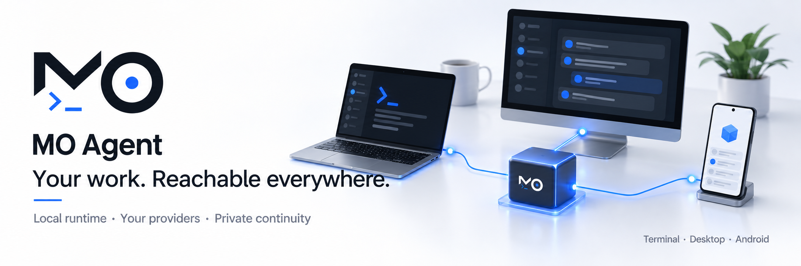

<p align="center">
  
</p>

<h1 align="center">MO Agent</h1>

<p align="center">
  <strong>One local agent runtime. Honest progress. Reachable everywhere.</strong>
</p>

<p align="center">
  <a href="https://github.com/IQMO/MO/actions/workflows/ci.yml"></a>
  
  <a href="LICENSE"></a>
</p>

Run agent work on your own computer or server and stay connected when you leave
the desk. MO can inspect and edit project files, run commands, track long tasks,
and schedule work using your chosen AI provider. Its runtime keeps tool results,
task evidence, and private continuity together so you can inspect what happened.

Start in the terminal. Add the optional Desktop companion for screen interaction,
or pair MO Everywhere for Android to follow conversations and work, reach your
authorized machines, and transfer files from your phone. Connected features need
your configured, running MO host; the phone also offers separate direct AI chat.

**[Install MO](#quickstart)** · **[Choose an interface](#reachable-everywhere)** ·
**[See MO Everywhere](#mo-everywhere-in-one-minute)** ·
**[Read the FAQ](FAQ.md)**

> Start with the [critical FAQ and surface comparison](FAQ.md) if you want to
> understand what runs where, what stays private, or which interface to use.

## Why MO

- **Work on real projects.** Ask MO to inspect code, make changes, research a
  question, organize files, or run your project's checks with its configured tools.
- **Keep longer work moving.** Start background tasks, schedule a future turn,
  and return to recorded progress and explicit shared conversations.
- **Review mail and track personal matters.** Connect Gmail or use Outlook in
  MO Connected Tab, then search, read, and explicitly move mail in Agent chat
  or Desktop's Email view. Confirm payments, subscriptions, appointments, and cases in Life; record
  income and outgoings there and set explicit reminders through the existing
  scheduler. See [mail setup](core/mail/README.md) and
  [Life records](core/life/README.md) for the privacy and account limits.
- **Stay connected away from the desk.** Through your Hub, Android can reach
  authorized Desktop and terminal hosts, browse files, and follow work.
- **Choose your provider.** Use DeepSeek, Z.ai, OpenCode, OpenAI/Codex OAuth,
  Ollama, or a custom OpenAI-compatible endpoint. Provider access and costs are
  yours; MO does not include an AI subscription.
- **Keep continuity under your control.** Configuration, credentials, memory,
  learning and sessions live in your private MO home. Your selected provider
  still processes the content you send to it.
- **See the evidence behind progress.** Task completion is tied to recorded
  tool and verification results, rather than the model's confidence alone.

## Reachable everywhere

| Surface | Best for | What you need |
| --- | --- | --- |
| **MO Terminal** | Coding, research, file work, goals, reviews and automation | The base install and your provider; add screen tools only when needed |
| **MO Desktop** | Dashboard, visual design, screen help, voice and files | Optional companion and computer-use packages; native Desktop is Windows-focused |
| **MO Shell** | Keep the terminal beside a selected app in a floating workspace | Optional native Windows shell around the existing terminal |
| **MO Everywhere for Android** | Conversations, tasks, schedules, Remote and Files while away | Google Play access and your running Hub for connected features; separate **This phone** chat needs only your provider |
| **Telegram** | Remote conversation and approvals | Your configured bot and running MO service |
| **Headless service** | Keep the Hub, scheduler and integrations running | Your computer/server, selected extras and private configuration |

Detailed ownership, capability, and limitation rows are in
[FAQ — Which MO surface should I use?](FAQ.md#which-mo-surface-should-i-use).
The machine-checked [product and capability contract](CAPABILITIES.md) maps
every built-in command and major capability to its runtime, surface, state,
security, discovery, and acceptance owners.

## MO Everywhere in one minute

**[Watch the 60-second walkthrough](https://youtu.be/OgEWYONoGlo)** ·
**[Closed-test access on Google Play](https://play.google.com/apps/testing/app.moagent.mobile)** ·
**[Features and setup](ANDROID.md)**

The film uses native Android UI with fictional sample content and supporting
illustration. Your own running computer/server supplies connected agent work;
the phone does not run the full MO tool runtime. Android is currently in
**closed testing for eligible users**, with Google Play as its only public
installation and update source. The [Android guide](ANDROID.md#availability)
owns current availability. The repository contains no Android package downloads.

## Quickstart

You need Git, Python 3.10+, and access to one supported AI provider or a local
model server. MO runs from this checkout; you do not need to develop MO or install
its maintainer test tools to use it. The base install has five direct dependencies.

### 1. Install and initialize

On **Windows PowerShell**, use the virtual environment's Python directly:

```powershell
git clone https://github.com/IQMO/MO.git
cd MO
python -m venv .venv
.\.venv\Scripts\python.exe -m pip install --upgrade pip setuptools
.\.venv\Scripts\python.exe -m pip install -r requirements.txt
.\.venv\Scripts\python.exe mo.py --init
```

On **Linux or macOS**:

```bash
git clone https://github.com/IQMO/MO.git
cd MO
python3 -m venv .venv
.venv/bin/python -m pip install --upgrade pip setuptools
.venv/bin/python -m pip install -r requirements.txt
.venv/bin/python mo.py --init
```

Keep this checkout and virtual environment: the generated command uses them.
If your Linux Python installation lacks `venv` or pip, install those components
through your operating system's package manager first.

Initialization creates your private `~/.mo` home, config and credential templates,
and the `mo`/`mo.cmd` launchers under `~/.mo/bin`. On Windows, `~` means your user
profile directory. Repeating `--init` preserves existing config and credentials.
It does not initialize or modify the project you are working in.

### 2. Configure a provider

Choose one provider from [`config.example.yaml`](config.example.yaml). For the
default DeepSeek route, fill in `DEEPSEEK_API_KEY` in the generated private
`~/.mo/credentials/providers.env`. You do not need keys for every provider listed
in the template. Provider availability, model access, and billing belong to your
provider account.

In `~/.mo/config.yaml`, keep the selected provider's configuration and set
`model.default` to its name. For example, these are the relevant DeepSeek sections:

```yaml
providers:
  - name: deepseek
    type: chat_completions
    base_url: https://api.deepseek.com
    api_key_env: DEEPSEEK_API_KEY
    model: deepseek-v4-pro

model:
  default: deepseek
```

MO reads provider keys from that canonical credential file. `api_key_env` is a
logical key name, not a request to read arbitrary process environment variables.
Keep keys and personal configuration out of the checkout.

Local Ollama models use the same `chat_completions` interface at
`http://localhost:11434/v1`; no MO-specific local-model dependency is required.
For the other supported routes, see [Which providers work?](FAQ.md#which-providers-work).

### 3. Run MO in your project

Add `~/.mo/bin` to your user `PATH` once and open a new terminal. Go to the project
you want MO to work on, then run:

```text
mo
```

The launcher uses MO's virtual environment while preserving your current project
directory. Without changing `PATH`, invoke `& "$HOME\.mo\bin\mo.cmd"` in PowerShell
or `~/.mo/bin/mo` on Linux/macOS from the same project directory.

Try a small first task: **“Read this project's README and explain how to run it.
Do not change files.”** Use `/credentials` to check provider readiness without
displaying keys, `/model` to select a provider/model, and `/doctor` for runtime
health. For scripts, the same launcher supports:

```text
mo -p "review the current diff and report verified findings"
mo --prompt-file task.txt
```

`/model`, `/show`, `/hints`, and `/activity` save Terminal preferences privately;
authored config remains the baseline. `/doctor personalization` provides a
read-only profile, learning, memory, and retention audit. `/profile provider`
records profile metadata only.

### Install only the extras you use

Run optional pip commands with the same virtual environment's Python used above
(or activate that environment first). Terminal text, file, shell, and provider
work do not need the Desktop, voice, Hub, or local embedding packages.

| Optional use | Install in MO's virtual environment |
| --- | --- |
| Desktop companion and native screen/input tools | `python -m pip install -r requirements-computer-use.txt` on a machine with a display; native Desktop is Windows-focused |
| Serving Everywhere Hub | `python -m pip install -r requirements-everywhere.txt` on the serving computer/server |
| MO Design windows | `python -m pip install -r requirements-design.txt` |
| Read embedded PDF text | `python -m pip install -r requirements-perception.txt` |
| Local semantic memory embeddings | `python -m pip install -r requirements-embeddings.txt`; keyword recall and API embeddings do not need it |
| Local Desktop voice | Use the [isolated voice installer](mo_desktop/README.md#voice); it manages `requirements-voice.txt` separately |

`requirements-dev.txt` is for maintaining MO, not normal use. Optional features
can also require platform tools or permissions described in their own guides.

### Limit provider requests

To enforce a request limit, set it explicitly in your private config:

```yaml
agent:
  max_provider_requests_per_turn: 8
```

Run `/reload`, then `/settings` to check the configured value. The default is
`0` (unlimited). For a one-shot run, use
`mo --config path/to/config.yaml --prompt-file task.txt` with your configured
provider and this limit. A limit written only in the prompt is not enforced.

The cap counts model completion attempts, including retries and auxiliary or
worker calls started from that turn. Internal continuation shares the same
allowance. Exhaustion stops further provider requests and leaves unfinished
work open. HTTP redirect hops, credential refresh and separate embedding work
are outside this count. It is not a token, cost, or elapsed-time limit.

Python callers can override the config for one turn with
`gateway.run_turn("Review the current diff", max_provider_requests=8)`.
The argument defaults to `None` (use config); `0` disables the cap for that new
turn.

### Optional surfaces

- **MO Desktop is an opt-in auto-intent companion.** Install the computer-use
  extras above, set
  `mo_desktop.enabled: true`, then run
  `python -m mo_desktop` or use `/desktop`. See
  [`mo_desktop/README.md`](mo_desktop/README.md).
- **MO Design desktop previews:** install
  `python -m pip install -r requirements-design.txt`. Open **MO Design** from
  the Desktop tray or let MO create a design during a turn. A `.modesign` file can
  also be opened directly with `python -m mo_desktop.mo_renderer path.modesign`.
  Explicit sketch and diagram requests can open the same artifact as a compact
  Board-only window connected to the exact originating terminal. A drawing
  follow-up reads the current Board; Accept/Reject returns only the draft
  decision and does not grant implementation authority.
  See the [artifact format](core/design/README.md) and
  [Studio runtime](mo_desktop/design_studio/README.md) guides.
- **Everywhere hub and native clients:** install
  `requirements-everywhere.txt` on the one serving owner, run the normal
  `mo_service.py`, and follow `/everywhere setup`. See
  [`mo_everywhere/README.md`](mo_everywhere/README.md).
- **Headless container:** `Dockerfile` and `compose.yaml` run the same
  `mo_service.py` owner as a non-root user with read-only image source, one
  explicit private-state mount, and one mounted project workspace.
- **Android resident Dashboard/Chat/Control/Files:** install only from Google
  Play when eligible, then pair it with the serving hub. The Android guide below
  owns the current release status and closed-test versus Production availability.
  See [`ANDROID.md`](ANDROID.md).

### Headless Docker service

Set two path-only variables in an untracked `.env` beside `compose.yaml` (do
not put credentials there — provider keys belong in
`~/.mo/credentials/providers.env`; the tracked [`.env.example`](.env.example)
is the name-only template for that credentials file, not for this one):

```env
MO_STATE_DIR=/absolute/private/path/mo-state
MO_WORKSPACE=/absolute/path/to/the/project
```

The state directory must be outside the MO checkout and writable by the image
user (UID/GID 10001 by default; override `MO_UID`/`MO_GID` when building on
Linux). Initialize that mounted private home once, then start the resident:

```text
docker compose build
docker compose run --rm --entrypoint python mo /app/mo.py --init
docker compose up -d
```

Edit `config.yaml` and the canonical credential files directly inside
`MO_STATE_DIR`; secrets are never build arguments or image layers. The default
compose service publishes no ports. Use the documented native host/TLS
deployment for an Everywhere hub instead of exposing its loopback API from
this default container.

## Core capabilities

<details>
<summary>Explore the full capability and behavior reference</summary>

### Evidence-backed work

- Gateway-owned task lifecycle with procedure scaffolds or model-authored plans.
- Evidence-gated `complete_task`; failed checks stay blocked.
- Sandboxed file, shell, browser, desktop, phone, network, and MCP dispatch.
- Final-answer gates for completion, verification, safety, and unsupported
  current-state claims.
- Exact confirmation boundaries for destructive, publication, payment-like, or
  high-impact actions.

### Coding and project intelligence

- Read, search, edit, shell, Git status, test execution, and project inspection.
- One persisted structural graph with bounded search, caller/callee,
  neighborhood, path, explanation, and impact views.
- `mapthis` partitioned whole-project orientation without loading every source
  file into one model context.
- Project-work turns resolve the applicable ancestor-to-project `AGENTS.md` rule
  chain before provider work. If none exists, MO previews a minimal starter and
  creates it at the project root on a permitted project edit or execution, subject
  to the existing write permissions. Inspection leaves the project unchanged.
  Before reporting, changed rules are supplied for review; unchanged rules stay silent.
- `/knowledge` inspects and queries an automatically maintained private project
  manifest of document headings, capabilities, commands, and current graph nodes
  with source references. The existing project-index worker maintains it
  asynchronously under the shared project refresh lease; one manifest byte lock
  serializes writers across MO instances. Status, query, Dashboard, and native
  `code_search` remain read-only and report an automatic refresh in progress
  instead of requiring a manual rebuild. Normal project-work turns receive a
  bounded query-matched slice whose selected source documents are reverified
  before use; test filenames remain inventory.
  See [knowledge scope](FAQ.md#what-is-knowledge).
- Optional LSP diagnostics, code-structure compaction, and recoverable source
  skeletons for long sessions.
- Inline terminal tables, charts, trees, images, and generated visual assets.
- First-party explainer-video projects turn sourced research and explicit local
  product media into narrated explainers or focused product demos with saved
  MO-system/project styling, hashed images and bounded clips, readable callouts,
  deterministic motion, optional Piper, staged FFmpeg encoding, mandatory FFprobe
  validation, and measured status through `mo --explainer` from any directory.
- MO Design turns a conversation into a self-contained declarative `.modesign`
  concept or interactive prototype (the default for new app/product/showcase
  requests unless the user asks for a static concept),
  preserves the user's full request under one observation-first visual contract,
  keeps the last finished visual stable while a new revision is generated, and
  restores each design's private conversation and optional project binding when
  switching sessions. Its shared **Board** lets the user sketch with pen pressure
  and simple shapes while MO proposes visible declarative drafts that only the
  user can accept or reject. Explicit diagram requests open a Board-only,
  pin-or-close window bound one-to-one to the exact originating terminal, while
  Desktop can open the saved Board unbound when no terminal is available. Board
  tools expose keyboard shortcuts, and MO receives bounded clear-placement
  evidence with accidental overlap rejected before a draft is shown;
  useful spatial or repeatedly unresolved clarification can offer it once without
  nagging. A compact runtime-only badge shows the exact originating terminal;
  on the next drawing follow-up MO reads the current Board, while Accept/Reject
  returns only the draft decision. Board chrome does not start another turn or
  grant implementation approval. A selected project is mapped from current source into the
  preview, but the design lane can write only the private Design artifact—not the
  project. Its MO-style window chrome matches the other Desktop utility surfaces.
  A failing preview interaction is captured once per revision and sent through
  the existing background worker for diagnosis. Project implementation requires
  explicit authority: Studio uses **Handoff**, while a Terminal already discussing
  that exact design may act on the user's implementation instruction after
  verifying the revision and target. Ordinary **Send** continues the
  visual conversation. The eventual Handoff sheet recaps the actual saved
  concept and asks only which MO recipient should receive it; that explicit
  action continues as a normal turn in the exact connected terminal, starts a
  headless background goal, or opens a goal in a new visible MO terminal.
  Background requires a selected safe project, while an interactive receiving
  terminal can confirm an otherwise unresolved target before writing.
  Current-surface work observes available pixels before updating and never invents
  live state or treats deferred refinement as a present change; the same worker visually checks the
  rendered preview once before finishing, with at most one correction and one
  re-observation. Only the background route publishes a completion notice through MO's existing
  cube/tray/platform notification owner. Design reuses Terminal's saved `/model`
  selection through the [shared model owner](core/MAINTAINING.md#presentation-adapter-boundary),
  with no independent Studio chooser or artifact setting. Its native attachment picker can add bounded files, images,
  or documents to one Design message as untrusted evidence without exposing the
  original path to generated content. A requested visual update requires a newer
  changed visual after the worker finishes. Questions may finish with an explicit
  conversational response; an explicit brief-only update requires changed brief
  fields. Arbitrary metadata cannot prove visual completion; missing required
  evidence produces a retry state. Activating a completion notice opens the exact
  saved design in the existing Studio window instead of creating another renderer.
  Its revision badge opens bounded selectable history: choosing an older version
  previews it without creating another revision, and that exact version can be
  downloaded, handed off, or explicitly deleted when it is not current. The
  compact **+** starts a clean isolated Design session, and refresh safely reloads
  the finished preview.

### Durable workflows

- Saved sessions, explicit resume, retries, undo, project history, and
  structured closeouts. A fresh terminal remains isolated, while the latest
  same-surface saved user request is available as secret-redacted JSON
  historical context for natural follow-ups without silently reopening that
  conversation. Before a terminal turn's first provider request, MO checkpoints
  that active user request through the same atomic session snapshot; a clean
  turn-end save replaces the checkpoint, while a power/process loss leaves a
  bounded interrupted-request marker that continuity can distinguish from the
  older completed transcript.
- The Ctrl+B workspace rail loads profile projects, expands their local or host
  terminals, and switches live project groups without stopping their processes.
  New terminals use the selected project's directory; existing MO sessions keep
  their original project. The UI has no combined pane-count cap; host launches
  retain the serving supervisor's resource limit. Local PTYs own raw interactive
  keys; a focused host tile keeps the visible
  composer and sends one complete message on Enter. Host drafts remain separate,
  MO slash commands remain owned by the original main pane, and host panes reuse the existing
  Everywhere hub-terminal supervisor and `mo_session` Live Control owner. A new
  **MO host** pane always starts on the serving host; Desktop terminal actions
  remain separate for portable and external-control callers. The hub pins its
  resolved non-secret profile/project/auth-file routing into the new terminal,
  so a persistent multiplexer cannot reuse stale profile state; controller and
  provider credentials remain separate. `Alt+Up/Down`
  scrolls each pane's own bounded history or full-screen app navigation;
  `Alt+Home/End` jumps to that pane's oldest/newest available output, and
  `Alt+F` toggles the focused pane between the grid and the full workspace. The
  Health view shows a quiet snapshot of machine resources and attached terminal
  process trees, adding a local total only when multiple local trees make it
  useful. The selected provider stays visible while `/status` owns the detailed
  runtime report. Connected hosts supply bounded
  CPU/memory observations through the authenticated status/socket path without
  claiming a control lease; older hosts show unsupported readings. Each MO pane
  reuses the one terminal-title publisher for `MO · <first request> · tasks
  <current>/<total> · <instance> · <provider>/<model>` when a taskboard is active,
  omitting absent fields and retaining the existing working spinner. Titles stay
  bounded and redacted; legacy `MO · <instance> · <model>` titles remain attachable.
  The Ctrl+B rail prioritizes that session topic while the stable instance ID still
  owns routing, and each pane keeps one of six skin-owned title accents. The
  rail also keeps readable terminal roles, pane positions and compact state markers, with
  each project row labeled with its source; nested terminals inherit that source.
  In split mode, MO's status, hints, composer and footer stay inside pane 1;
  local PTYs keep their own terminal screen chrome without an added MO composer.
  Ctrl+B shows or hides the rail. Opening it refreshes terminal discovery and host
  observations once; leaving it open does not poll hosts or repaint on a timer.
  Opening Health requests one local snapshot.
- Explicit `/session share <name>` and `/session unshare <name>` control which
  named conversations may appear on scoped Everywhere clients; local sessions
  are never published automatically.
- Autonomous goal mode with progress, evidence, replanning, pause, and resume.
- Evidence-gated [PRT review](FAQ.md#what-are-goal-mode-and-prt) with deterministic local checks, bounded
  affected-test evidence, durable reports, and a trusted GitHub Actions review
  lane. Plain `/prt` selects uncommitted work when present, otherwise HEAD.
  Worktree/path targets report only; commit/range targets send
  confirmed violations through the existing Agent worker for correction and
  focused verification, followed by reassessment until the target is met or
  further progress is blocked with a reason and actual score.
- Persistent scheduled turns, goals, roles, and approved private scripts.
- Profile-authored skill-backed roles govern interactive conversations and background work. `Project Architect` coordinates project-bound specialist packs through MO's existing worker runtime; `Life Story Book Writer` resumes from `BOOK-STATE.md` in the user-selected workspace and follows the user's chosen production format. Role packs do not replace MO's sandbox, authority, or confirmation gates.
- Optional resumable cross-surface file cargo with stable device targeting,
  sender retry custody, chunk and whole-file verification, and target receipts.
- Bounded MO Files views on Desktop and Android discover the current hub, each
  connected Desktop or terminal host, and the separately
  consented phone as explicit sources. A selected machine exposes opaque
  MO-home/allowed-project or approved-Personal locations; it exposes
  drive roots only when that machine already runs with `access.mode: full`.
  Compact multi-selection, revision-safe edit/rename/copy/move, recoverable
  Trash, dynamic device send, and Incoming/Outgoing progress all reuse the
  existing file and transfer owners. Desktop's WebView board also offers an
  explicit, short-lived local browser QR transfer for devices without MO;
  that LAN HTTP connection requires a trusted private network.
- Windows Desktop Settings, tray, MO Files, MO Phone, MO Design, dialogs, and
  pointer surfaces consume one strict active visual state. The shared
  `interface/desktop_brand.py` owner supplies static four-cube geometry for
  Windows HTML shells and native icons; surfaces supply only scale and skin
  tokens. The Android app keeps one native live renderer for its mobile
  callers rather than adding a cross-runtime generation layer. Settings alone
  persists skin, panel/button geometry, and one shared window-effect type and
  intensity; changes repaint existing windows without replacing their companion,
  startup, file, transfer, phone, or Design owners.
- MO SystemCare performs device-local Windows calibration and read-only Safe or
  Advanced health/startup/performance/gaming diagnostics on demand. Its compact
  Game Session extends the reversible global Game Mode journal with calibrated
  start/current resource context, verified restoration, a Care-cube shortcut and
  a dimmed single-cube active control; it adds no telemetry worker and does not
  stop services or close applications. Cleanup is limited to catalog-owned user
  targets and requires a fresh exact plan, revalidation, explicit non-undo
  acknowledgement, and later-turn confirmation; it has no generic registry
  cleaner and never inspects `personal/`.

### Private personalization

- Curated profile facts, approved learning, materialized local skill packs, and
  query-ranked episodic recall. Owned project, repository, and server inventories
  remain profile-owned even when phrased with temporal modifiers such as `now` or
  `today`; their bounded context prioritizes canonical query-matched facts without
  duplicating the full facts file. Operator-defined terms are profile-owned and
  are expanded before intent, approval, and first-call tool routing; they are not
  project-local commands.
- Durable operational facts trigger the profile-capture capability on the first
  provider call, while visible conversation is stripped from trusted surface
  wrappers before episodic indexing.
- Authorized private Telegram turns participate in the same memory and learning
  path as other direct operator conversations. Telegram group and supergroup
  turns remain isolated from owner learning.
- Confirmed learning has one active runtime authority: a materialized local skill
  pack suppresses equivalent virtual adapters, including repeated confirmed
  suggestions with different candidate IDs. Retired generated packs are durable
  tombstones: their source suggestions stay inactive across review, startup,
  reconciliation, bundle transfer, and materialization. Explicit workflow promotion
  always materializes its pack; candidate rows never activate behavior.
- Generated skill use is recorded only when that skill's guidance actually fits
  in the active context bridge. The same delivered-skill decision stores a
  bounded per-session name-and-turn receipt. Terminal projects that exact receipt
  once on the matching turn's neutral notice rail. The next provider turn receives
  the same fact as context for natural-language follow-ups. The receipt does
  not claim the provider followed the guidance. Later explicit correction or
  explicit positive feedback settles the pending outcome; an unrelated or neutral
  next turn does not invent success.
- Relative follow-ups reuse the current conversation's task for relevant profile
  rules, skills and recall, including after session reload. New subjects use their
  own query. New learned code conventions belong to the current project and apply
  to their declared files or an explicit name request within that project. The
  Dashboard labels older unbound conventions as cross-project. Recalled excerpts
  retain source IDs and fit individually within
  the context budget; traces distinguish prepared material from delivered guidance.
- `/learning` opens a selectable Terminal review queue across ordinary suggestions
  and workflow habits. Select an item to see what changes, why, and its example or
  source guidance; use Tab or Left/Right to choose **Approve**, **Dismiss**, or
  **Back**, then Enter. Up/Down scrolls details. Pending items remain inactive;
  **Active learning** explains accepted suggestions and offers **Undo learning**.
  Actions bind to the reviewed item, not its queue position; changed items require
  a fresh review. Existing numbered/text commands remain callable, but the menu
  needs no copied IDs. [Automatic learning and review](FAQ.md#does-learning-need-my-approval-every-time)
  explains which patterns can activate without another approval.
  `/learning status` shows the current setting and
  `/skills` lists materialized workflow skills. Optional scans, consolidation and
  skill imports sit under **More actions**; they are not routine learning steps.
  `/profile mine` uses the same effective active/pending review as `/learning`.
- Local SQLite/FTS5 memory with optional local or configured semantic fusion.
- One bounded, Cube-branded dashboard projection for user and operations
  perspectives across Terminal, browser/read-only HTML, Desktop, and Android.
  `mo --dashboard` or `/dashboard show` opens the connected frameless MO workspace
  through the existing optional native WebView renderer;
  work commands use the normal MO terminal, with no embedded terminal or voice UI.
  Rules edit their MO Files source; learning review and project LSP controls use
  their existing owners directly, and knowledge queries reuse `/knowledge`.
  See the [Dashboard guide](core/dashboard/README.md).
  It shows direct work/learning state, counts, provenance, and existing
  navigation actions without inventing a confidence percentage. Portable projections
  exclude profile prose, memory text, learning text, prompts and credentials;
  authenticated local learning review reveals the selected item's source details. In the
  Terminal, durable and actionable learning-lifecycle events appear in the
  persistent transcript activity lane; the compact footer remains reserved for
  short operational notifications and does not duplicate those learning
  messages.
- Local Dashboard Project checks exposes sampled verification evidence; its
  LSP control saves on/off per current project using normal private preferences.
  Configure installed servers in `lsp.servers`; no auto-install or extra model
  is involved. See the [LSP guide](FAQ.md#can-i-control-language-server-checks-per-project).
- Raw episodic memory, learning stores, prompts, and task evidence remain
  under their established review/approval owners rather than becoming
  dashboard-editable state.
- Interactive Terminal defaults are a separate, private personalization layer:
  `/model`, `/show`, `/hints`, and `/activity` update one `preferences.json`
  overlay without rewriting the operator-authored `config.yaml` baseline.
  `/hints` controls curated one-line discovery tips; non-comment lines in the
  optional MO-home `hints.txt` replace the built-ins after MO restarts.
- `personal/` remains opaque and is never automatically indexed, synchronized,
  migrated, or deleted.

### Perception and actuation

- Screen capture, local-image and embedded-text PDF perception, Connected
  Chrome-tab DOM/viewport control, and native Windows UI Automation.
- An exact owned Windows window can provide whole-window or target-relative
  pixel evidence while covered, without MO activating it. Unsupported renders
  fail closed unless that same target is already foreground for the visible
  fallback; minimized windows are not supported. Raw pointer and keyboard input
  remains foreground-bound and may interrupt the active desktop.
- Observe → target → act → verify ownership; a mutation consumes the observation
  that authorized it.
- Once MO Connected Tab is installed, MO discovers ordinary Chrome tabs and
  connects to the requested tab automatically on observation—no per-tab click.
  Terminal and Desktop retain their separate ownership; Design receives
  observation only. One native channel stays ready, and Chrome's stop control
  remains effective. MO opens no second browser or profile. Native-window
  interaction remains available when it satisfies the requested workflow.
  See the [MO Connected Tab guide](clients/chrome/README.md) for setup, updating,
  status, DevTools conflicts, and removal.
- Image generation, safe image transforms, and cross-surface image delivery.
- MO Everywhere for Android provides Store-delivered Hub chat, Dashboard,
  background work, Files, Desktop/terminal control, selected-folder sharing,
  and phone-only provider chat. See
  [Android availability](ANDROID.md#availability) before treating a current
  capability as generally available from the Store.

### Extensibility

- Lazy MCP servers with per-server `allow_tools` filters and scoped credential
  injection.
- Native, HTTP-compatible, OAuth, and local model providers.
- Custom skills, role packs, and profile-owned Desktop apps.

</details>

## How the runtime fits together

<details>
<summary>Runtime ownership, code navigation, and multiple terminals</summary>

```text
Terminal / Desktop / Android / Telegram
                    │
                    ▼
          Agent + Gateway + final gates
                    │
          ┌─────────┼──────────┐
          ▼         ▼          ▼
       tools     task truth   private state
          │         │          │
          └──────── evidence ───┘
```

- `core/agent/` owns provider/tool orchestration.
- `core/gateway.py` and `core/tasking/` own task lifecycle and evidence.
- `core/tooling/` plus `tools/` own tool definitions, dispatch, and sandboxing.
- `core/session/`, `core/profile/`, `core/learning/`, and `core/state/` own
  private continuity.
- `interface/` and `mo_desktop/` are presentation and device adapters; the
  separately distributed Android client is another adapter. None becomes a
  competing task authority.
- `mo_everywhere/` is the optional authenticated hub and relay.

### Graph authority

`core/graph/structural_graph.py` owns the only native persisted graph.
`core/graph/code_graph.py` is its in-memory source extractor, not a second output.
Native state lives at
`~/.mo/cache/structural_graph/<project-digest>/`; an existing
`<project>/graphify-out/graph.json` is read-only compatibility input when the
native graph is absent. There is no `code_graph` output directory.
Native builds run in an isolated, time-bounded helper and cover the whole
project by default. Set `MO_CODE_GRAPH_MAX_FILES` to a positive number only when
the local machine needs an explicit file cap; `0` keeps whole-project coverage.
Startup and turn maintenance may finish that helper after a project-work turn
has begun. At the next provider checkpoint, MO supplies one fresh bounded graph
slice when it is relevant instead of leaving the turn on its earlier
"unavailable" result. When the shared refresh then finishes project knowledge
and Git history, an active turn that started without either source receives
their current bounded slices at its next checkpoint too. The terminal reports
each delivery through its existing context receipt; graph and history remain
orientation that must be checked against source.
Bounded direction keeps concrete file owners, public tool executors, and an
explicitly named product surface ahead of incidental prose matches. A direct
prohibition such as `do not use MCP` does not promote MCP as a requested symbol.
Top-level identifier-like registry keys contribute only bounded vocabulary to
their Python file owner; they do not become graph nodes. Requested product,
verification, and documentation seeds render before expanded neighbors; the
next ranked owner is retained before expansion, and relevant neighbors precede
alphabetical topology noise. Project-documentation context spends its budget on
verified source rows instead of repeating the request.

The graph's in-memory BM25 index, episodic SQLite/FTS5/vector recall, and a
human project map are complementary systems. MO and maintainers
consume bounded graph slices and never load or dump the whole graph into model
context.

### Multiple terminals

Each process receives a stable `MO_INSTANCE_ID` and defaults to a separate
`main-<instance>` session. Opening another terminal cannot overwrite the first
terminal's active slot. Singleton services use a resource lock.

On nontrivial turns, workspace coordination reuses those live instance
heartbeats to warn when another terminal has active work in the same repository.
That signal never assigns unclaimed dirty files to the sibling terminal.
Explicit PRT reviews capture independent source snapshots, so sibling activity
does not block them or require a commit. See the
[PRT review contract](core/MAINTAINING.md#prt-review-contract) for source,
concurrency, evidence, and verification boundaries.

</details>

## Verification, measured honestly

MO keeps reproducible verification close to the code:

| Evidence | Reproducible result |
| --- | --- |
| Episodic recall benchmark | 30 paraphrased queries over 55 turns: BM25 recall@1 `0.667`, recall@3/5 `0.800`, MRR `0.722`; controlled fusion demonstration recall@3/5 `1.000` |

Reproduce the dependency-free memory benchmark with:

```bash
python -m core.learning.recall_benchmark
```

Its “hybrid” column is deliberately labeled a controlled concept-embedder
demonstration, not a production embedding-model benchmark. Current Python suite
evidence belongs in the CI run and changelog rather than an undated marketing
claim.

## Documentation

| Document | Authority |
| --- | --- |
| [`CAPABILITIES.md`](CAPABILITIES.md) | Product charter, capability owners, and complete command coverage |
| [`FAQ.md`](FAQ.md) | Critical user questions and full surface comparison |
| [`MAP.md`](MAP.md) | Compact source and ownership map |
| [`AGENTS.md`](AGENTS.md) | Repository work contract for maintainers |
| [`core/MAINTAINING.md`](core/MAINTAINING.md) | Runtime, state, graph, and public/private invariants |
| [`interface/README.md`](interface/README.md) | Terminal interface contract |
| [`mo_desktop/README.md`](mo_desktop/README.md) | Desktop behavior and configuration |
| [`mo_desktop/MAINTAINING.md`](mo_desktop/MAINTAINING.md) | Desktop maintenance boundaries |
| [`mo_everywhere/README.md`](mo_everywhere/README.md) | Hub, continuity, pairing, API, and Live Control |
| [`clients/chrome/README.md`](clients/chrome/README.md) | Connected Chrome setup, consent, status, removal, and source ownership |
| [`ANDROID.md`](ANDROID.md) | Android availability, requirements, setup, and user privacy boundary |
| [`mo_publisher/README.md`](mo_publisher/README.md) | Optional public publisher pages, isolated AI-report custody, and operating requirements |
| [`CHANGELOG.md`](CHANGELOG.md) | Repository change history |

Validate public documentation links with:

```bash
python -m core.diagnostics.docs_check
```

## Privacy and security

- The repository contains product code, not operator profile data.
- Credentials stay in scoped files under `~/.mo/credentials/` and never enter
  model-visible config.
- Tool calls pass through path, network, command, actuation, and secret guards.
- High-impact actions use exact target-and-parameter confirmation.
- Normal terminal use requires no inbound network listener.
- Everywhere and Telegram are opt-in; device grants are revocable and scoped.
- The public checkout preflight blocks tracked secret literals, private paths,
  maintainer scratch identifiers, tracked test overlays, and credential-source
  drift.
- Suspected vulnerabilities use the private
  [security reporting policy](.github/SECURITY.md), never a public issue.

Run the public boundary and documentation gates:

```bash
python -m core.diagnostics.test_preflight --guards-only
python -m core.diagnostics.docs_check
```

## Distribution

MO runs from a Git checkout. Android installation and updates are handled only
through Google Play for eligible users; the [Android guide](ANDROID.md)
records the current track and availability. GitHub does not distribute Android
APKs or provide the Play app's updater.

### Project model

MO Agent is an owner-maintained open-source product for users, not a
community-governed development project. The tracked repository is the product
source; there is no reduced public fork maintained in parallel. Private profile
state, operator extensions, maintainer verification, and Android client sources
remain outside the tracked product boundary. Android is distributed publicly
only through Google Play; owner-device builds remain private local custody.

Reproducible product defects and documentation errors are welcome through the
repository's issue form. Unsolicited code contributions, feature proposals, and
contributor onboarding are not accepted. Never place credentials, private paths,
personal conversations, or unsanitized logs in an issue. See
[Project participation](CONTRIBUTING.md) before opening one.

### Update and recover

Use `/update` in MO or `mo --update` from a terminal. The updater runs
`git pull --ff-only` in MO's own checkout, refreshes base requirements when that
file changes, and asks you to restart. It refuses a checkout with local changes;
your separate project directory is not the update target. Do not discard your
edits to make an update pass.

If Git reports a network or authentication problem, resolve access to the
configured repository and retry. If dependency installation fails, rerun
`python -m pip install -r requirements.txt` with MO's virtual environment and
restart. Reinstall a selected optional requirements file when its dependencies
change; the base updater does not install every extra.

The initial public release starts from fresh repository history. If you cloned
MO before that launch, the old checkout cannot fast-forward across the new
history: make a fresh clone and run `mo.py --init` there. Your private MO home
is separate from the checkout and remains available to the new installation.

After moving or recreating the checkout/virtual environment, run `mo.py --init`
with its new Python interpreter to refresh MO's generated launchers. Existing
private config and credentials are preserved. `/doctor` and `/credentials` help
diagnose runtime and provider setup without displaying credential values.

### Remove MO

1. Exit MO terminals and Desktop, disable Desktop startup if enabled, and stop
   any MO service you configured. Revoke paired devices on your Hub before
   retiring a connected host.
2. Remove optional integrations you enabled while the checkout is still present:
   follow the [Connected Tab removal guide](clients/chrome/README.md) and use
   `python -m mo_desktop.voice.install uninstall --yes` for the isolated voice
   environment if installed.
3. Remove the `~/.mo/bin` entry from your user `PATH`, its generated launchers,
   and the MO checkout with its virtual environment. Keep your project folders.

Your private `~/.mo` home is separate from the checkout. Keep it to preserve
configuration, memory, and conversations for a later installation. Delete that
home only if you intend to erase those records and credentials; a configured
`runtime.home`, `MO_HOME`, or `MO_STATE_HOME` may point elsewhere. Never delete
a parent folder containing other data. Provider accounts and separately hosted
Hub data are managed separately from uninstalling this local copy.

## License

MO Agent is licensed under the MIT License. See [LICENSE](LICENSE).
